## [docs](https://www.hejian.club/posts/toolsfunction)

## 工具函数
- deepCompare  // 比较2个对象的差异返回不同的属性和具体不同的值 params: {obj1: any, obj2: any, ignoreKeys: string[] | RegExp}
- deepMerge  // Object.assign的深度拷贝版本，返回合并后传入的第一个对象 params: {target: Record<any, any>, ...sources: Record<any, any>[]} => target
- asyncPool  // limit：控制异步并发执行的数量，tasks：异步任务数组
- quickFind  // quickFind(array: any[], key: any),返回一个新的实例,在实例中find方法可以根据key查找对应的项,查找效率O(1),set更新或新增项,delete删除项效率都是O(1)
- quickFilter  // quickFilter(array: any[], key: string | number | Array<string | number>, value: string | number | RegExp), 快速模糊查找key名字的项,支持正则匹配
- deepClone  // 简洁的深拷贝
- curry  // 函数柯里化
- memorizeFn  // 根据参数返回一个有缓存的函数
- debounce  // 函数防抖
- throttle  // 函数节流
- traverse  // 遍历对象或数组,快速从options中得到指定的属性值,traverse(arr, {
      'family.name'(target: any, index: number) {
        console.log(target, index,)
      }
    })
- transformKey  // 将对象的key转换成需要的key,transformKey(obj, {
      'family.name': 'familyName',
      'family.age': 'familyAge'
    })
- isStr  // 判断是否是字符串
- isNum  // 判断是否是数字
- isPlainObject  // 判断是否是对象
- isArray  // 判断是否是数组
- isFn  // 判断是否是函数
- isUndef  // 判断是否是undefined
- isNull  // 判断是否是null
- isPromise  // 判断是否是Promise
- isSymbol  // 判断是否是Symbol
- isNaN  // 判断是否是NaN
- isReg  // 判断是否是正则表达式
- vFetch  // 基于fetch的axios api式请求封装  type VFetchConfig = {
  url?: string // 请求地址
  baseURL?: string // 基础url
  body?: any // body参数 {},GET请求会合并到url后面
  method?: Method // 请求类型 默认GET 'GET' | 'POST' | 'PUT' | 'DELETE' | 'OPTIONS' 支持vFetch.get | post | delete | put的形式
  headers?: Record<string, any> // 请求头 例如: {'Content-Type': 'application/json'} 支持在请求拦截器中设置追加 config.headers.set('x-token', token)
  credentials?: Credentials // 请求是否带上cookie 默认omit 'include' | 'same-origin' | 'omit' 
  params?: Record<string, string> // 请求参数 根据bodyType决定是否会被序列化
  timeout?: number // 超时时间 ms 默认为20000
  responseType?: ResponseType // 返回类型 默认json 'formData' | 'text' | 'blob' | 'arrayBuffer' | 'json'
  bodyType?: BodyType // 请求类型 默认json 'json' | 'form' | 'file' 
  cache?: Cache // 缓存类型 默认不缓存 'no-cache' | 'default' | 'force-cache' | 'only-if-cached' 
  redirect?: Redirect // 重定向 默认follow follow：跟随重定向，error：抛出错误，manual：手动处理
  mode?: Mode // cors, no-cors, same-origin 默认cors cors：跨域，no-cors：不跨域，same-origin：同源
  transformResponse?: (response: Response) => Response // 响应数据转换
}
- interceptError  // 自动捕获传入函数执行的异常

## 使用方法
### deepMerge
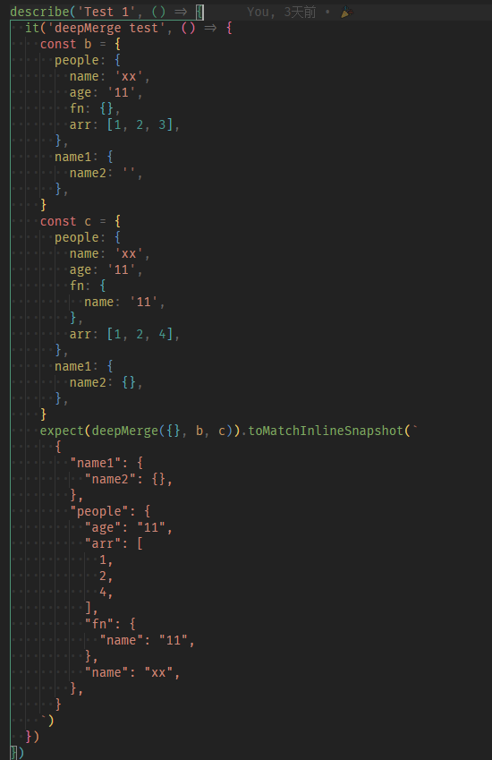
### deepCompare
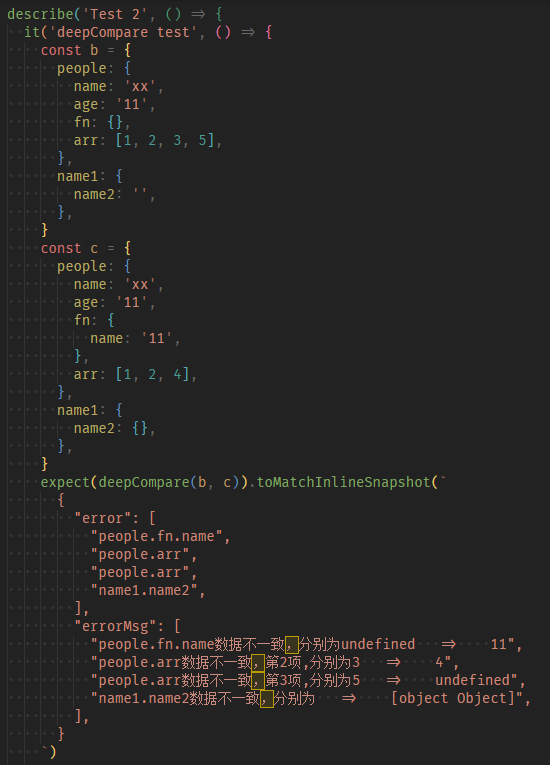
### asyncPool
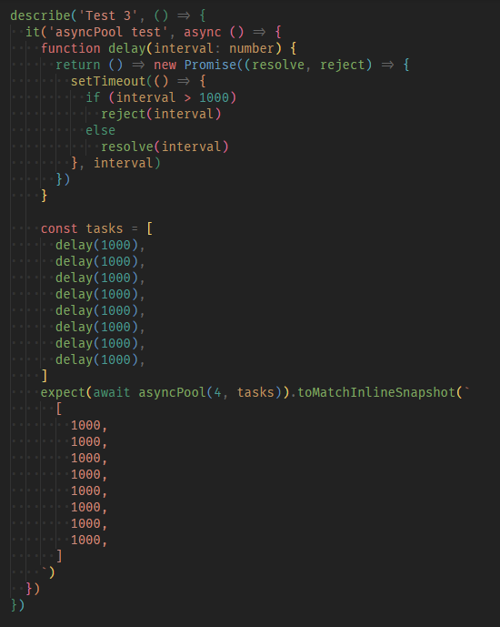
### quickFind
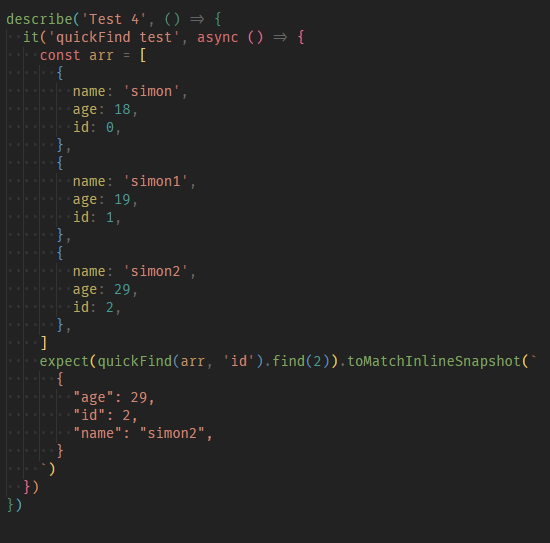
### quickFilter
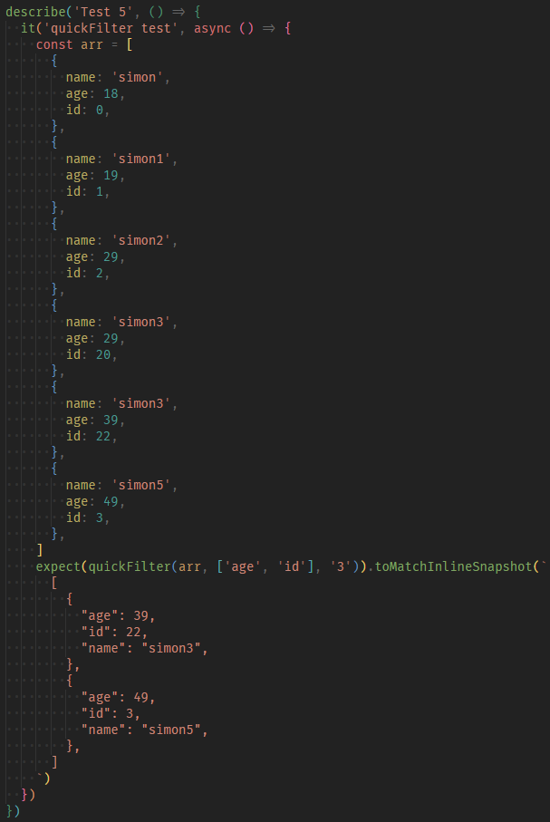
### deepClone
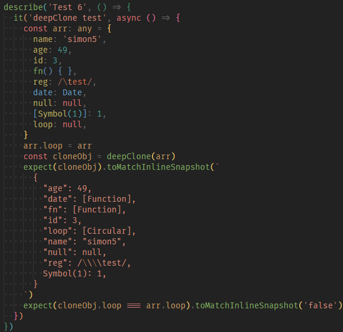
### curry
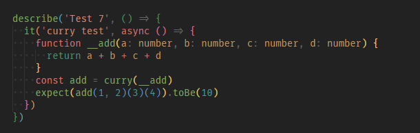
### memorizeFn
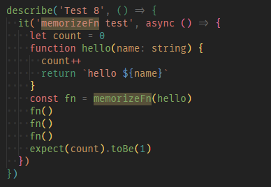
### debounce
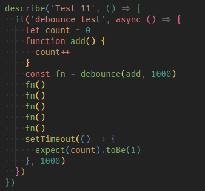
### throttle
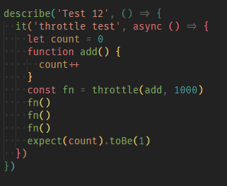
### traverse
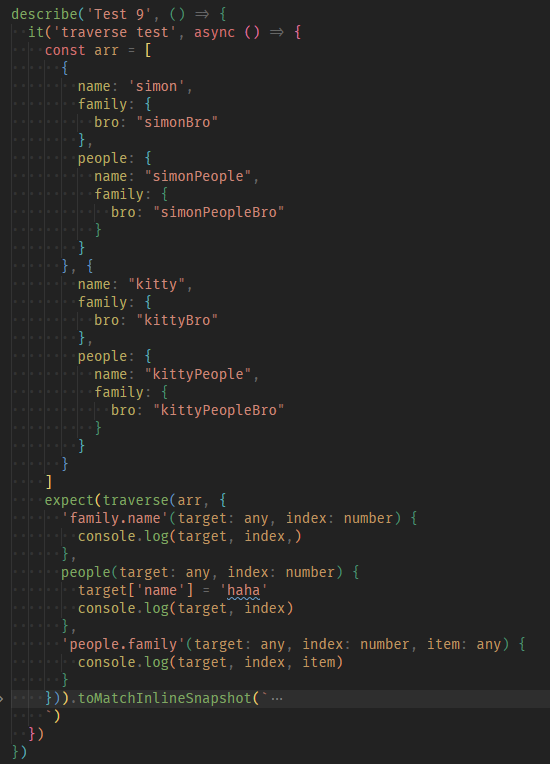
### transformKey
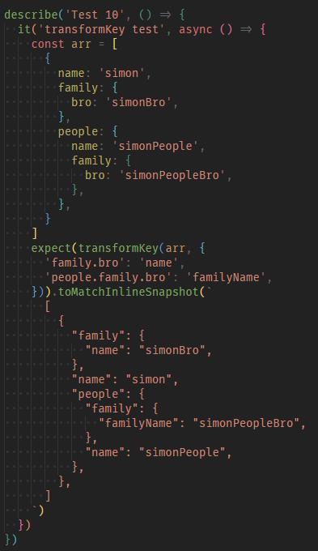
### vFetch
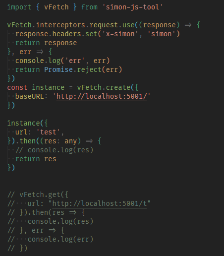

