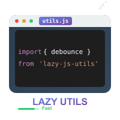

# simon-js-tool :tongue:

<p align="center">

</p>
<p align="center"><a href="https://www.npmjs.com/package/simon-js-tool"></a>
<a href="https://www.npmjs.com/package/simon-js-tool"></a>
<a href="https://github.com/Simon-He95/simon-js-tool"></a>
</p>
<p align="center"><a href="http://vitepress.hejian.club/">Docs</a></p>
<p align="center"> <a href="./README_en.md">English</a> | 简体中文</p>

## 此文是介绍封装的工具函数的文档[simon-js-tool](https://www.npmjs.com/package/simon-js-tool)
目前整理了<strong>90+</strong>的常用函数,还在持续更新中...,你的认可是对我最大的鼓励! :hearts:

## 🔥 亮点
- 纯js的工具函数,不依赖vue,react,angular
- dom操作的api封装,如在vue中使用是不需要onMounted获取dom节点的,可以直接使用class或者id传入
- 副作用函数,可以在函数执行的结果去stop,也会在页面销毁时被自动stop
- api设计简单、实用

## :balloon: 更多
- 导出函数 [exports-function](https://github.com/SimonHe1995/exportsFunction)
- threejs [@simon_he/s-three](https://github.com/SimonHe1995/sThree)
- Echarts [@simon_he/s-chart](https://github.com/SimonHe1995/sCharts)
- numsWheel [@simon_he/nums-wheel](https://github.com/SimonHe1995/numsWheel)
- vAxios [@simon_he/v-axios](https://github.com/SimonHe1995/vAxios)

## :coffee: 赞助我
<table>
<tr>
<td width="500" align="center">

</td>
<td width="500" align="center">
  
</td>
</tr>
</table>

## :book: 使用说明
```bash
npm i simon-js-tool # 安装

import { 
  deepCompare
 } from 'simon-js-tool' # 按需引入

```

## GitHub地址
[欢迎PR](https://github.com/Simon-He95/simon-js-tool)
